# 无约束优化算法性能对比实验

> 计算数学上机实验 · 2025-12-04 ·（作者信息已脱敏）

## 1 实验目的

1. 掌握无约束最优化的核心算法：最速下降法、牛顿法、拟牛顿法、共轭梯度法、信赖域算法。
2. 编程实现这些算法，统计迭代次数、收敛速度与稳定性。
3. 理解算法原理差异（一阶梯度信息、二阶导数信息、搜索方向更新策略）对优化性能的影响。

## 2 实验内容与要求

### 2.1 测试函数

**测试函数 1：2D Modified Rosenbrock**

$$f(x_1,x_2)=(1-x_1^2)^2+100(x_2-x_1^2)^2+5\sin(2\pi x_1)\sin(2\pi x_2)$$

正弦修正项引入更强的非线性成分，使函数包含多个局部极小点。

**测试函数 2：4D Rosenbrock**

$$f(x_1,x_2,x_3,x_4)=\sum_{i=1}^{3}\Big[(1-x_i^2)^2+100(x_{i+1}-x_i^2)^2\Big]$$

全局极小点 $x^*=(1,1,1,1)$，$f^*=0$。

### 2.2 实现的算法

**最速下降法** 线搜索算法之一，基于一阶展开 $f(x+d)\approx f(x)+g^\top d$，取负梯度方向 $d_k=-g_k$。一阶近似收敛速度为线性，$x_{k+1}=x_k+\alpha_k d_k$。

**牛顿法** 基于二阶 Taylor 展开
$$f(x_k+d_k)\approx f_k+g_k^\top d_k+\tfrac12 d_k^\top G_k d_k,$$
得 $d_k=-G_k^{-1}g_k$，固定步长 $\alpha=1$，$x_{k+1}=x_k-G_k^{-1}g_k$。

**BFGS 拟牛顿法** 不直接计算二阶矩阵，用 $B_k\approx G_k^{-1}$ 近似 Hesse 逆，$d_k=-B_k g_k$，$x_{k+1}=x_k+\alpha_k d_k$。修正满足割线条件 $B_{k+1}y_k=s_k$，秩-2 更新 $B_{k+1}=B_k+\beta_k u_k u_k^\top+\gamma_k v_k v_k^\top$，其中 $u_k=y_k,\ v_k=B_k s_k$：
$$B_{k+1}=B_k+\frac{y_k y_k^\top}{y_k^\top s_k}-\frac{B_k s_k s_k^\top B_k}{s_k^\top B_k s_k}$$

**共轭梯度法** 要求方向满足共轭性 $d_k^\top G d_j=0,\ g_k^\top d_j=0\ (j<k)$，$d_{k+1}=-g_k+\beta_k d_k$，起始 $d_0=-g_0$。修正系数：
$$\beta_k^{\mathrm{FR}}=\frac{g_k^\top g_k}{g_{k-1}^\top g_{k-1}},\qquad
\beta_k^{\mathrm{PRP}}=\frac{g_k^\top (g_k-g_{k-1})}{g_{k-1}^\top g_{k-1}}$$
线性情形两式一致；非线性时因 Hesse 变化而有别，分别记为 FR 与 PRP。

**信赖域法** 不化为一维问题，而在 $x_k$ 处用二次模型近似
$$q_k(d)=f(x_k)+\nabla f_k^\top d+\tfrac12 d^\top \nabla^2 f_k\, d,$$
在半径 $\Delta_k$ 的区域内搜索。用 dogleg 方法：计算牛顿方向 $p^B$ 与负梯度的最优截断 $p^U$；若 $\|p^B\|\le\Delta_k$ 取牛顿方向，若 $\|p^U\|\ge\Delta_k$ 缩放最速下降（Cauchy）方向，否则取二者连线与信赖域边界的交点。半径由模型下降与实际下降之比
$$\rho_k=\frac{f(x_k)-f(x_{k+1})}{q_k(0)-q_k(d)}$$
更新：$\rho_k<\eta_1$ 时 $\Delta_{k+1}=0.25\,\Delta_k$；$\rho_k>\eta_2$ 时 $\Delta_{k+1}=\min(2\Delta_k,\Delta_{\max})$；否则不变。迭代至不再改变为止。

### 2.3 参数设置

- **初始点**：测试函数一 $(-1.2,1)$；测试函数二 $(1.2,1,0.8,0.6)$。
- **收敛准则**：$\|\nabla f\|<10^{-6}$，最大迭代次数 1000。
- **精确线搜索**：0.618（黄金分割）法求解 $\min_{\alpha\le\alpha_{\max}}f(x+\alpha d)$；设 $f$ 单峰，每次在 $[\varphi\alpha_1+(1-\varphi)\alpha_2,\ (1-\varphi)\alpha_1+\varphi\alpha_2]$ 上收缩试探区间。
- **非精确 Armijo**：$f(x_k+\alpha_k d_k)\le f(x_k)+c_1\alpha_k g_k^\top d_k$。
- **非精确 Wolfe**：在 Armijo 充分下降条件外，加曲率条件 $\nabla f(x_k+\alpha_k d_k)^\top d\ge c_2\, g_k^\top d_k$。

## 3 实验结果与分析

### 3.1 测试函数一（2D Modified Rosenbrock）

**迭代次数**（行：算法×线搜索；列：初始点。1000 表示达到最大迭代未收敛）

| 算法 / 线搜索 | (−1.2, 1.0) | (0, 0) | (1, 1) | (−1.5, 3) |
|---|---|---|---|---|
| SD · Armijo   | 64   | 17   | 1 | 80   |
| SD · Wolfe    | 1000 | 1000 | 1 | 1000 |
| SD · Golden   | 23   | 9    | 1 | 44   |
| Newton · Armijo | 9    | 1000 | 1 | 6  |
| Newton · Wolfe  | 1000 | 1000 | 1 | 6  |
| Newton · Golden | 6    | 1000 | 1 | 7  |
| BFGS · Armijo | 11   | 9    | 1 | 9  |
| BFGS · Wolfe  | 1000 | 12   | 1 | 9  |
| BFGS · Golden | 7    | 9    | 1 | 8  |
| CG-FR · Armijo | 276 | 1000 | 1 | 1000 |
| CG-FR · Wolfe  | 71  | 899  | 1 | 37   |
| CG-FR · Golden | 37  | 66   | 1 | 71   |
| CG-PRP · Armijo | 55 | 24  | 1 | 45 |
| CG-PRP · Wolfe  | 46 | 31  | 1 | 39 |
| CG-PRP · Golden | 21 | 8   | 1 | 9  |
| Trust-Region · dogleg | 8 | 4 | 1 | 6 |

**结论** 牛顿法迭代次数最少，共轭梯度最多；Wolfe 线搜索的迭代次数普遍偏多。真实解约在 $f\approx-4.51$，本题几乎没有点陷入局部最优。从收敛曲线（图 1）看，Newton、BFGS、信赖域 dogleg 收敛最快且平滑，最速下降最慢；共轭梯度对线搜索策略高度敏感，CG-FR 在部分情况下不稳定甚至数值发散。从优化路径（图 2）看，正弦扰动使函数出现多个局部极小，"香蕉形"狭长谷结构仍在——一阶方法易在局部涟漪中反复震荡，二阶方法与信赖域法能更好地捕捉整体谷形，路径更平滑稳定。在非凸、多极小问题中，初始点选择与算法鲁棒性同样重要。

**图 1** 初始点 $(-1.2,1.0)$ 下各算法收敛曲线（纵轴为 $\|\nabla f(x_k)\|$ 的对数尺度；子图顺序依原文：(a) SD、(b) Newton、(c) BFGS、(d) CG-FR、(e) CG-PRP、(f) Dogleg）

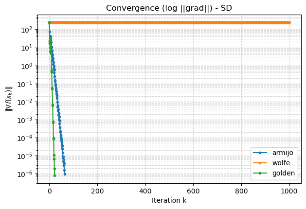
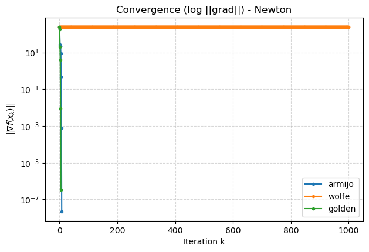
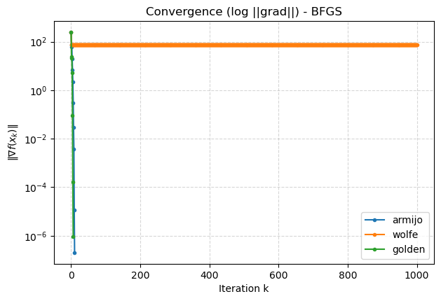
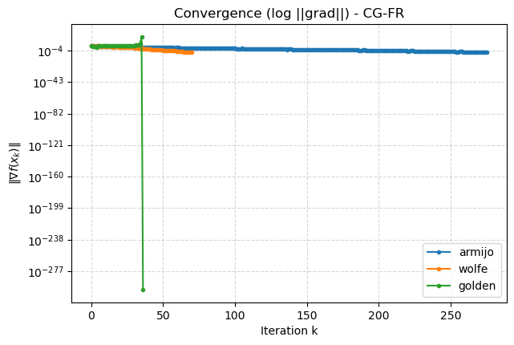
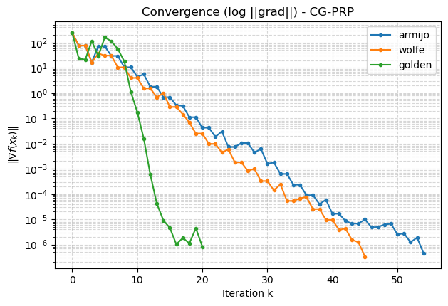
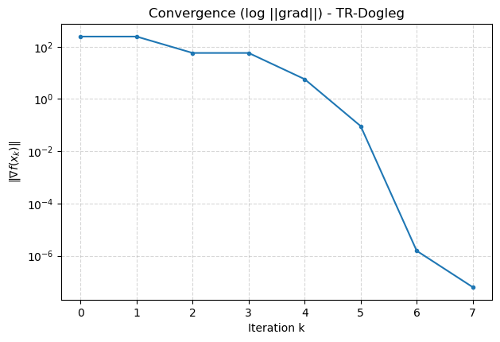

**图 2** Modified-Rosenbrock 在四个初始点下的优化路径（(a) $(-1.2,1.0)$、(b) $(-1.5,3.0)$、(c) $(0,0)$、(d) $(1.0,1.0)$）

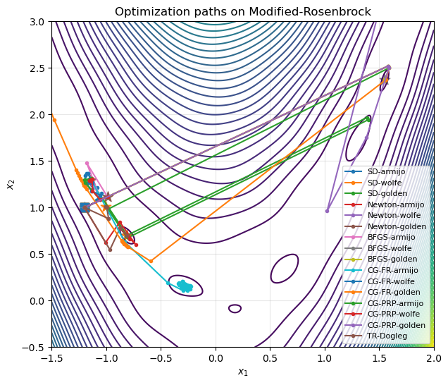
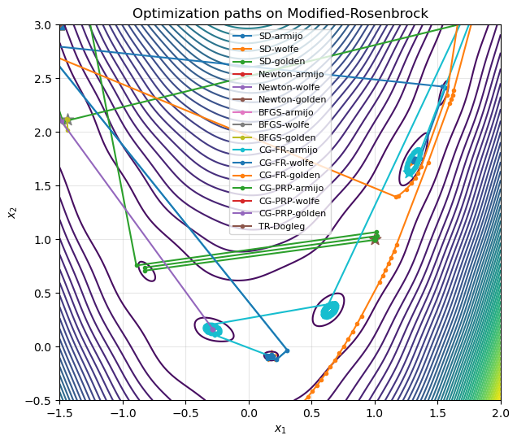
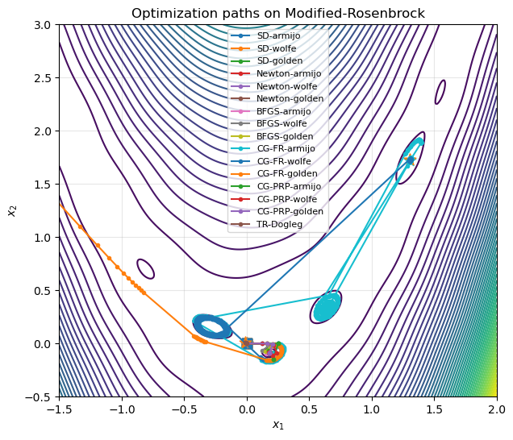
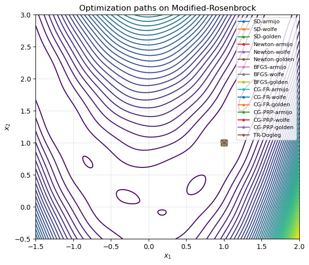

### 3.2 测试函数二（4D Rosenbrock）

**迭代次数**

| 算法 / 线搜索 | (1.2,1,0.8,0.6) | (1,1,−1,−1) | (9,8,7,6) | (0.9,0.9,0.9,0.9) |
|---|---|---|---|---|
| SD · Armijo   | 1000 | 1000 | 1000 | 1000 |
| SD · Wolfe    | 1000 | 1000 | 1000 | 1000 |
| SD · Golden   | 1000 | 1000 | 1000 | 1000 |
| Newton · Armijo | 1000 | 15 | 61 | 8 |
| Newton · Wolfe  | 1000 | 17 | 60 | 8 |
| Newton · Golden | 1000 | 17 | 58 | 8 |
| BFGS · Armijo | 50 | 52 | 81 | 20 |
| BFGS · Wolfe  | 46 | 1000 | 78 | 25 |
| BFGS · Golden | 26 | 31 | 48 | 12 |
| CG-FR · Armijo | 477 | 387 | 502 | 666 |
| CG-FR · Wolfe  | 822 | 879 | 1000 | 303 |
| CG-FR · Golden | 172 | 56 | 187 | 38 |
| CG-PRP · Armijo | 202 | 319 | 284 | 201 |
| CG-PRP · Wolfe  | 222 | 541 | 453 | 191 |
| CG-PRP · Golden | 50 | 98 | 10 | 35 |
| Trust-Region · dogleg | 13 | 19 | 41 | 8 |

**结论** 在四维 Rosenbrock 上，Newton 法与信赖域方法收敛最快、最稳定；BFGS 在合适的线搜索下同样优异。最速下降与非线性共轭梯度在狭长谷结构中收敛缓慢、对线搜索高度敏感，CG-FR 部分情况甚至数值发散。结果与数值优化理论高度一致，验证了二阶方法与信赖域方法在病态非线性问题上的优势。

**图 3** 4D Rosenbrock 上各算法收敛曲线（纵轴 $\|\nabla f(x_k)\|$ 对数尺度，横轴迭代次数；子图顺序：(a) SD、(b) Newton、(c) BFGS、(d) CG-FR、(e) CG-PRP、(f) Dogleg）

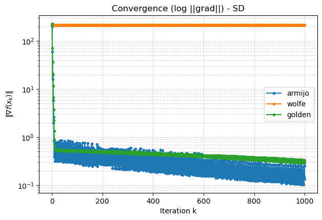
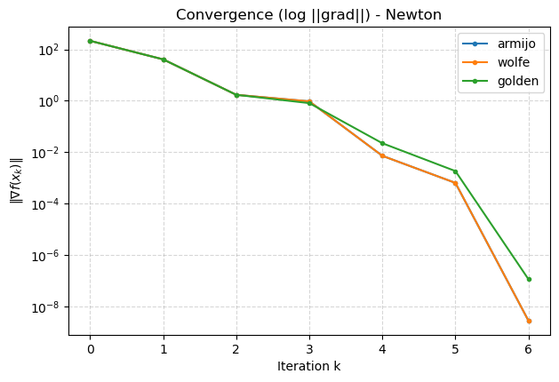
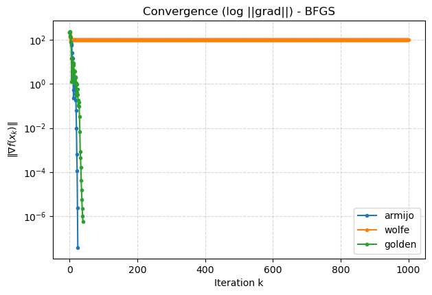
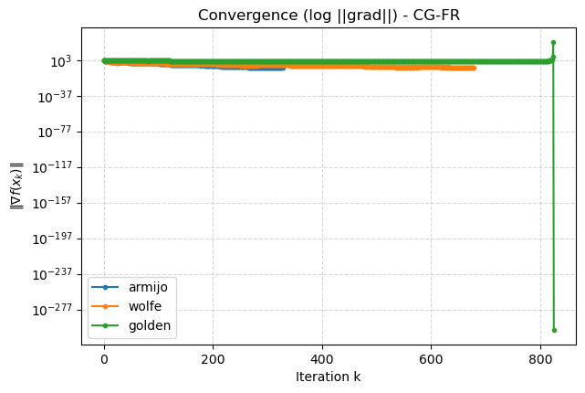
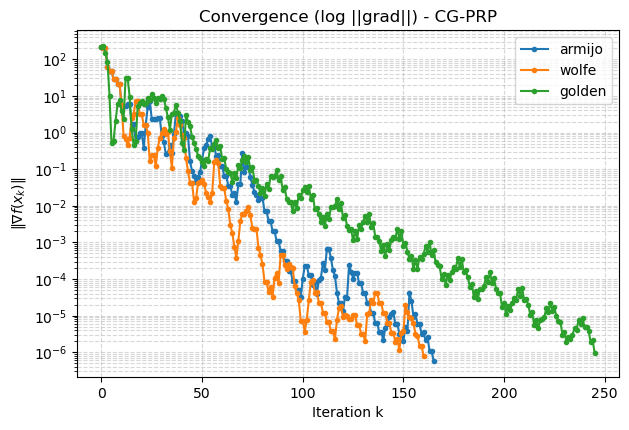
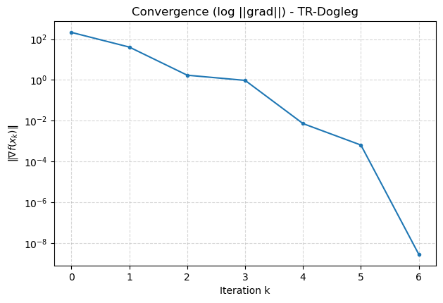

## 4 思考题

**4.1 牛顿法为何能一步二次终止**
牛顿法每步实质是求解一个二次子问题，对二次函数而言该子问题的解即原问题最优解，故一步到位；最速下降法只用一阶信息，求解同一二次问题往往需多步。

**4.2 BFGS 方法的核心思想**
拟牛顿法都在做同一件事：近似 Hesse（逆）以逼近二阶收敛，但不直接求二阶导，而是用梯度差分"做割线"。构造近似矩阵满足割线条件 $B_{k+1}y_k=s_k$，其中 $y_k=g_{k+1}-g_k,\ s_k=x_{k+1}-x_k$；通过秩-2 更新 $B_{k+1}=B_k+\beta uu^\top+\gamma vv^\top$（$u,v$ 分别对应 $y_k$ 与 $B_k s_k$）逐步逼近二阶 Hesse 的逆。

**4.3 为何共轭梯度法在非线性问题上不如拟牛顿法**
二次问题上两者等价（拟牛顿法的方向也满足共轭性）。但非线性时 Hesse 是变化的量：共轭梯度（如 PRP）仍在近似局部的二次矩阵，而 BFGS 每步更新 $B_k$ 时逐步累积对二阶 Hesse 的逼近。两个实验的数据也显示共轭梯度迭代次数更多、收敛到全局最优的比例更低。

---

## ⚠️ 待作者核对（内容还原说明）

本页由原始 PDF 报告脱敏、重排而来。pdftotext 抽取会打乱上下标，以下几处按标准形式还原，建议对照原 PDF 核对：

1. 测试函数中的 $(1-x_i^2)^2$ 项：标准 Rosenbrock 通常写作 $(1-x_i)^2$，"Modified" 版本是否有意为之请确认。
2. BFGS 更新式：$B_k$ 被定义为 Hesse 逆的近似，但更新式用的是"直接 Hesse 版"的 BFGS 形式，两者约定是否自洽请核对。
3. 信赖域 $\rho_k$：抽取文本分子分母顺序被打乱，已按"实际下降 / 预测下降"还原。
4. 共轭梯度方向：还原为 $d_{k+1}=-g_k+\beta_k d_k$（抽取文本显示为 $+g_k$）。
5. Wolfe 曲率条件：还原为 $\ge$（抽取文本显示为 $\le$）。
6. 图 1 / 图 3 六张子图按 PDF 内嵌顺序排列，子图与算法的对应关系（(a)–(f)）请对照原文确认。
